# SOLID Principles

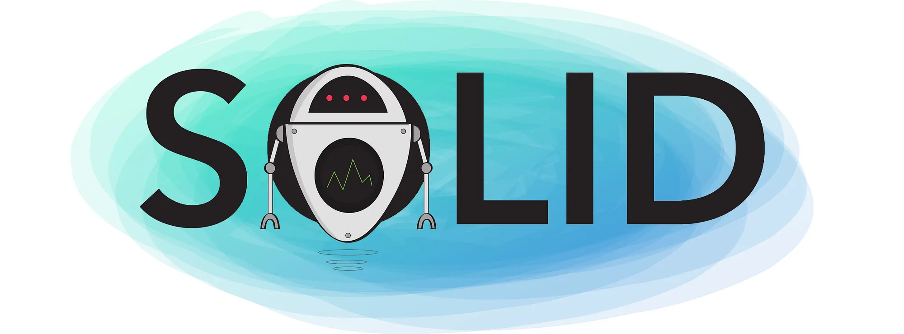

SOLID is an acronym for five design principles intended to make object-oriented software more understandable, flexible, and maintainable. It was popularized by Robert C. Martin ("Uncle Bob").

---

## Background: Coupling

Before diving into SOLID, it's important to understand **coupling** — the degree to which classes/modules depend on each other.

- **Tight (High) Coupling** — Classes are heavily dependent on each other's internal details. A change in one class forces changes in another. Hard to test, reuse, or maintain.
- **Loose Coupling** — Classes interact through abstractions (interfaces) rather than concrete details. Changes in one class have minimal impact on others.

> The goal of SOLID principles is generally to **reduce coupling** and **increase cohesion** (each class doing one well-defined job).

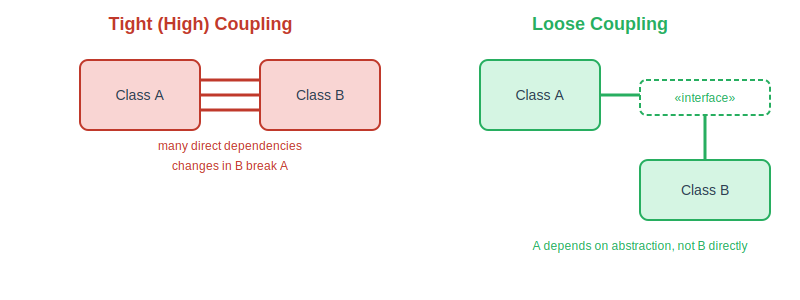

---

## Overview

| Letter | Principle | One-line Idea |
|--------|-----------|----------------|
| **S** | Single Responsibility Principle (SRP) | A class should have only one reason to change |
| **O** | Open-Closed Principle (OCP) | Open for extension, closed for modification |
| **L** | Liskov Substitution Principle (LSP) | Subtypes must be substitutable for their base types |
| **I** | Interface Segregation Principle (ISP) | Prefer many small interfaces over one large one |
| **D** | Dependency Inversion Principle (DIP) | Depend on abstractions, not concrete implementations |

---

## S — Single Responsibility Principle (SRP)

> A class should have **only one responsibility** and **only one reason to change**.

If a class handles more than one responsibility, changes to one responsibility can affect or break the other, making the code fragile and tightly coupled.

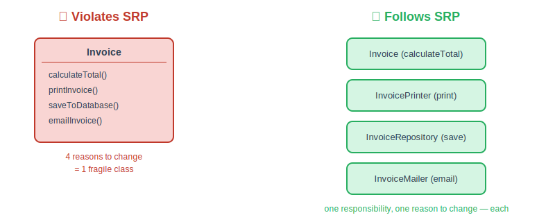

**Robot analogy:** think of a robot built to do *everything* — chef, gardener, painter, driver — versus a small team of specialist robots, each with one job. Fixing the "chef" robot never risks breaking the "driver" robot.


### Advantages
1. **Testing** — A class with one responsibility is much easier to write unit tests for.
2. **Lower Coupling** — Reduces dependencies between classes.
3. **Easier to Understand & Clean Code** — Small, focused classes are simpler to read and reason about.
4. **Organized Code** — Responsibilities are clearly separated across classes.

### Example

```java
// ❌ Violates SRP — handles both invoice logic AND printing/saving
class Invoice {
    void calculateTotal() { /* ... */ }
    void printInvoice() { /* ... */ }
    void saveToDatabase() { /* ... */ }
}

// ✅ Follows SRP — each class has a single responsibility
class Invoice {
    void calculateTotal() { /* ... */ }
}

class InvoicePrinter {
    void print(Invoice invoice) { /* ... */ }
}

class InvoiceRepository {
    void save(Invoice invoice) { /* ... */ }
}
```

---

## O — Open-Closed Principle (OCP)

> Software entities (classes, modules, functions) should be **open for extension** but **closed for modification**.

This means you should be able to add new functionality **without changing existing, working code** — typically achieved through abstraction (interfaces/abstract classes) and polymorphism.

### Why this matters
Modifying existing, tested code to add new behavior risks introducing bugs. Instead, new behavior should be added by writing new code that extends existing structures.

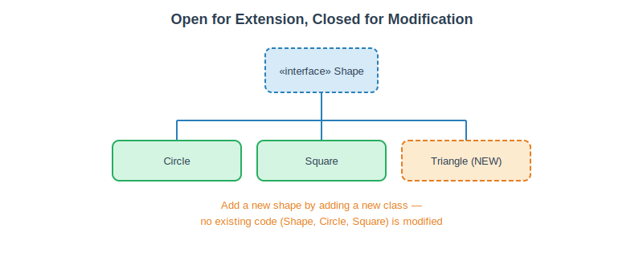

**Robot analogy:** a robot that can only "cut" gets sent off for a full rebuild every time it needs a new skill like "paint." A well-designed robot instead keeps its core the same and simply gains new interchangeable tools/skills without being torn apart and modified each time.

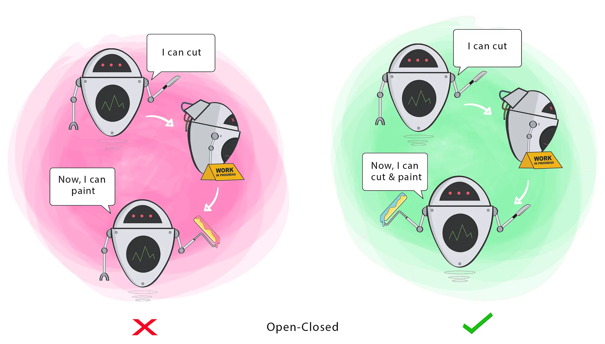

### Example

```java
// ❌ Violates OCP — must modify this method every time a new shape is added
class AreaCalculator {
    double calculate(Object shape) {
        if (shape instanceof Circle) { /* ... */ }
        else if (shape instanceof Square) { /* ... */ }
        // adding a new shape means modifying this class
    }
}

// ✅ Follows OCP — new shapes extend Shape, no existing code changes
interface Shape {
    double area();
}

class Circle implements Shape {
    public double area() { /* ... */ return 0; }
}

class Square implements Shape {
    public double area() { /* ... */ return 0; }
}

class AreaCalculator {
    double calculate(Shape shape) {
        return shape.area();
    }
}
```

### General Advantages (of applying good OOP/SOLID design, incl. OCP)
- **Reusable code**
- **Extensible system**
- **Maintainable system**

---

## L — Liskov Substitution Principle (LSP)

> If class **S** is a subtype (child) of class **T** (parent), then objects of type **T** should be replaceable with objects of type **S** without breaking the program.

In other words: a subclass should be usable anywhere its parent class is expected, without altering the correctness of the program.

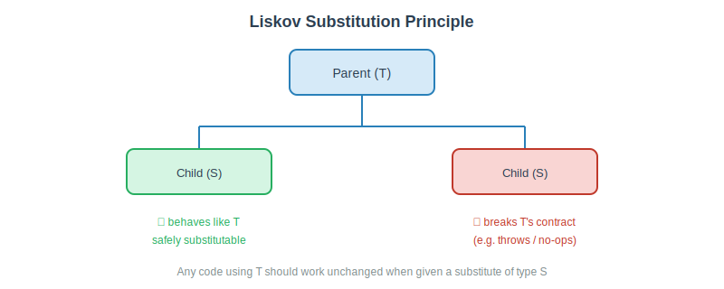

**Robot analogy:** if "Sam" (parent) makes coffee, then Sam's child "Eden" (a subtype of Sam) should also be able to make coffee when substituted in. If Eden instead hands you a bottle of water and can't fulfill the same request, the substitution breaks — Eden isn't honoring the contract Sam established.

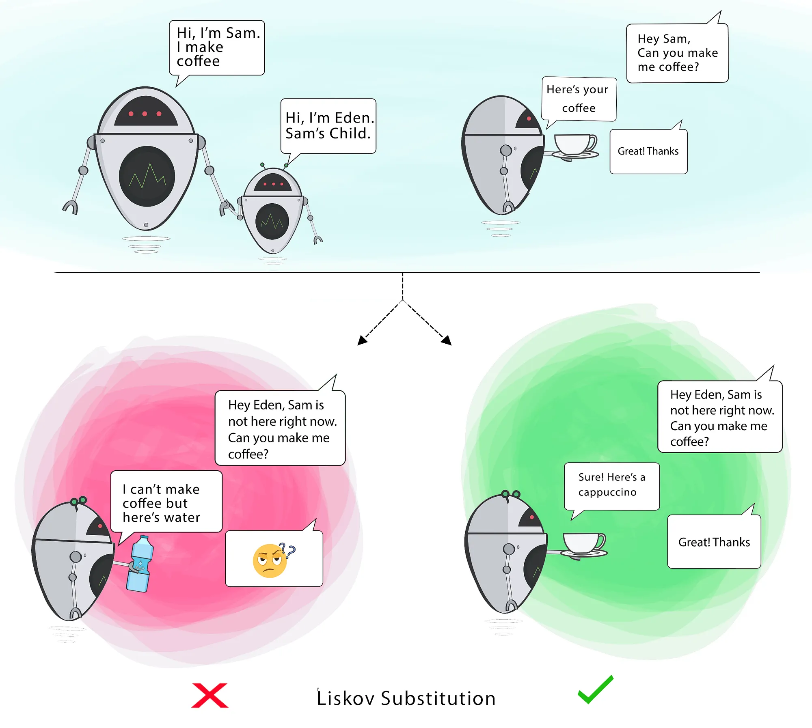

### Classic Violation Example

```java
class Bird {
    void fly() { /* ... */ }
}

// ❌ Violates LSP — Ostrich can't actually fly, breaks substitutability
class Ostrich extends Bird {
    void fly() {
        throw new UnsupportedOperationException();
    }
}
```

### Fixed Version

```java
class Bird { }

interface Flyable {
    void fly();
}

class Sparrow extends Bird implements Flyable {
    public void fly() { /* ... */ }
}

// ✅ Ostrich no longer forced to implement fly()
class Ostrich extends Bird { }
```

---

## I — Interface Segregation Principle (ISP)

> **Split large interfaces into smaller, more specific ones**, so that classes only need to know about (implement) the methods relevant to them.

Clients should not be forced to depend on methods they do not use. Large, "fat" interfaces force implementing classes to provide meaningless or broken implementations for methods they don't need.

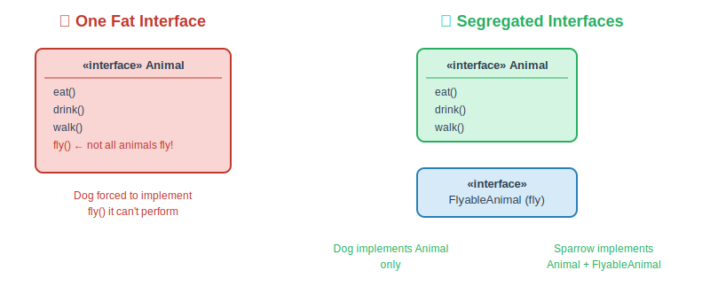

**Robot analogy:** don't hand every robot one giant "exercises" board listing spin, rotate arms, *and* wiggle antennas, if some robots don't even have antennas. Instead, give each robot only the board relevant to what it can actually do.

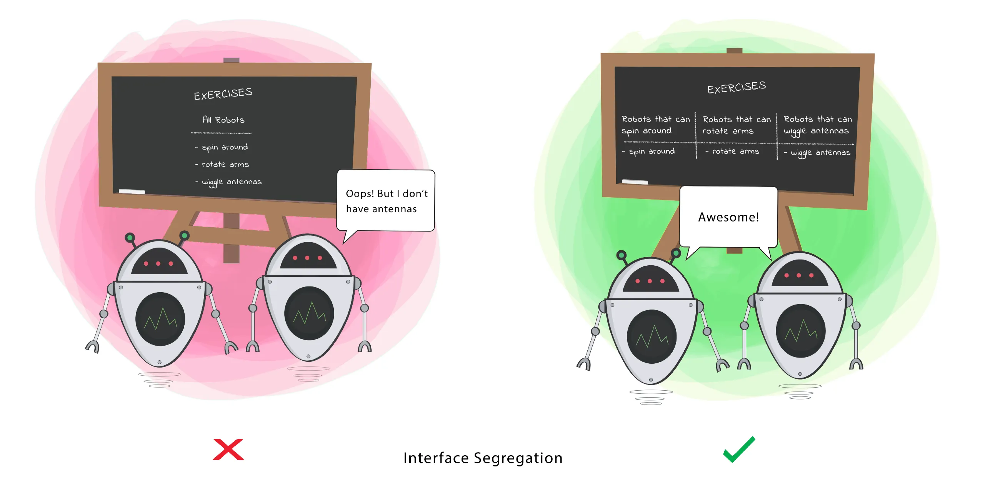

### Example (from the notes)

```java
// ❌ Violates ISP — not all animals can fly
interface Animal {
    void eat();
    void drink();
    void walk();
    void fly();
}

// ✅ Follows ISP — fly() is separated into its own interface
interface Animal {
    void eat();
    void drink();
    void walk();
}

interface FlyableAnimal {
    void fly();
}

class Dog implements Animal {
    public void eat()  { /* ... */ }
    public void drink(){ /* ... */ }
    public void walk() { /* ... */ }
}

class Sparrow implements Animal, FlyableAnimal {
    public void eat()  { /* ... */ }
    public void drink(){ /* ... */ }
    public void walk() { /* ... */ }
    public void fly()  { /* ... */ }
}
```

This keeps each interface focused on the **business need** it serves rather than bundling unrelated methods together.

---

## D — Dependency Inversion Principle (DIP)

> **High-level modules should not depend on low-level modules.** Both should depend on **abstractions**.
> **Abstractions should not depend on details.** Details should depend on abstractions.

- "High-level" = business logic / policy modules (more general, more "important" behavior)
- "Low-level" = concrete implementation details (specific classes, e.g. database access, file I/O)

Instead of a high-level class directly creating/using a low-level concrete class, both should rely on an interface (abstraction). This inverts the typical dependency direction — hence "inversion."

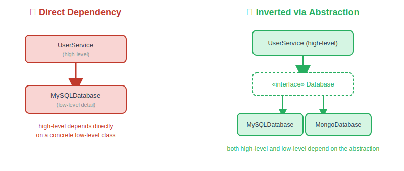

**Robot analogy:** a robot that says "I cut pizza with *my* pizza cutter arm" is locked into one specific tool. A better robot says "I cut pizza with *any* tool given to me" — it depends on the abstract idea of a cutting tool, not one specific hardwired implementation.

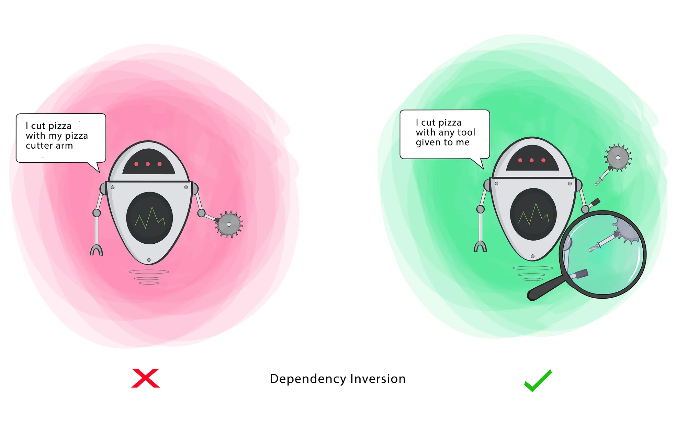

### Example

```java
// ❌ Violates DIP — high-level class depends directly on a concrete/low-level class
class MySQLDatabase {
    void save(String data) { /* ... */ }
}

class UserService {
    private MySQLDatabase db = new MySQLDatabase(); // tight coupling to a concrete class
    void register(String data) {
        db.save(data);
    }
}

// ✅ Follows DIP — both depend on an abstraction
interface Database {
    void save(String data);
}

class MySQLDatabase implements Database {
    public void save(String data) { /* ... */ }
}

class MongoDatabase implements Database {
    public void save(String data) { /* ... */ }
}

class UserService {
    private Database db; // depends on abstraction, not a concrete class

    UserService(Database db) { // dependency is "injected"
        this.db = db;
    }

    void register(String data) {
        db.save(data);
    }
}
```

### Key Related Concepts
- **Dependency Injection (DI)** — the technique of "injecting" (passing in) a dependency (e.g. via constructor, setter, or property) rather than having a class create it internally.
- **Dependency Inversion** — the broader design *principle* that DI is commonly used to implement: depend on abstractions, not concrete implementations.

> Rule of thumb: **higher-level code should be more abstract; more implementation detail should live in lower-level, concrete classes.**

---

## Summary Table

| Principle | Problem it Solves | Key Mechanism |
|-----------|--------------------|----------------|
| SRP | Classes doing too much, hard to change safely | Split responsibilities into separate classes |
| OCP | Modifying existing code introduces bugs | Extend via abstraction/polymorphism, don't modify |
| LSP | Subclasses breaking expected behavior | Ensure subtypes are truly substitutable |
| ISP | Classes forced to implement unused methods | Split large interfaces into smaller, focused ones |
| DIP | High-level code tightly coupled to low-level details | Depend on abstractions; use dependency injection |

## Why Follow SOLID? (Overall Benefits)
- **Reusable code**
- **Extensible systems** (easy to add new features)
- **Maintainable systems** (easy to understand, test, and modify)
- **Lower coupling**, **higher cohesion**
- Easier **unit testing**
